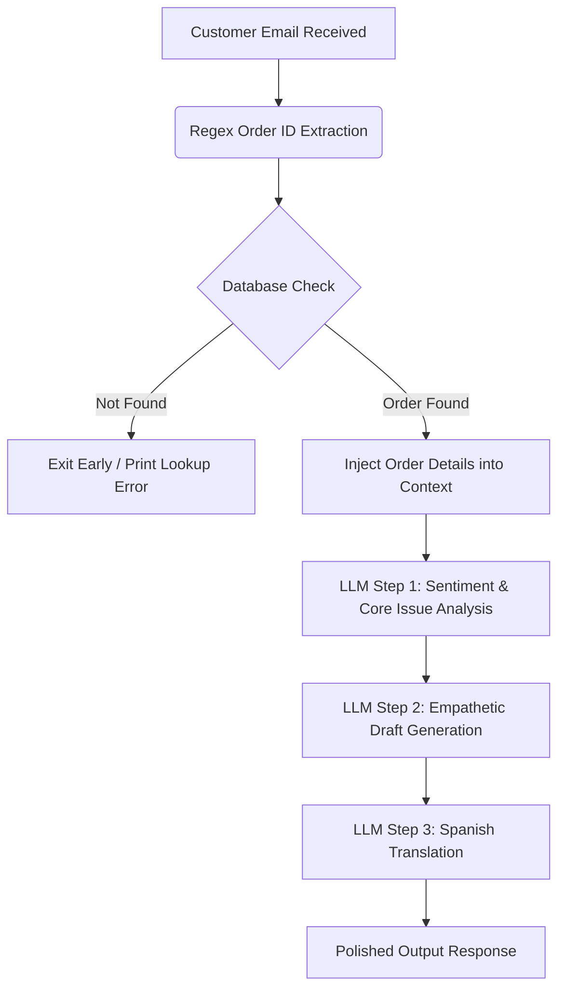

## 🚀 Overview

Prompt chaining is a technique where a complex task is decomposed into smaller, sequential steps. The output of one LLM call is fed as context into the next. 

This project extends that pattern by executing a **local database verification step** before initiating the LLM chain, ensuring the LLM only operates on real, verified facts.

## 🛠️ Features

* **Data-Grounded Logic**: Prevents hallucination by retrieving exact database records (status, carrier, tracking number) and feeding them to the prompt chain.
* **Early Validation**: Implements early-exit check to stop processing immediately if the resource (Order ID) does not exist.
* **OpenAI SDK & Gemini API Integration**: Uses standard `openai` library targeting Google Gemini's OpenAI-compatible API (free tier).
* **Multi-Format Run**: Supports running via Jupyter Notebook (`prompt-chaining.ipynb`) or standalone Python script (`prompt_chaining.py`).

## 📁 Repository Structure

* `prompt-chaining.ipynb`: The interactive Jupyter Notebook walkthrough.
* `orders_db.json`: The simulated local database of customer order records.
* `.env.example`: A template for setting your environment variables.

## 🧪 Scenarios Demonstrated

### Scenario 1: Successful Order Lookup (Order #98765)
The order is successfully retrieved from the database. The system:
1. Extracts `98765`.
2. Locates shipping details (carrier, tracking, estimated delivery).
3. Analyzes customer frustration.
4. Generates an empathetic response detailing their specific tracking information.
5. Translates the final email response into professional Spanish.

### Scenario 2: Failed Order Lookup (Order #99999)
The customer requests details for an order that does not exist. The system:
1. Extracts `99999`.
2. Fails the database check.
3. Exits early, returning an error message and bypassing any LLM API calls.
