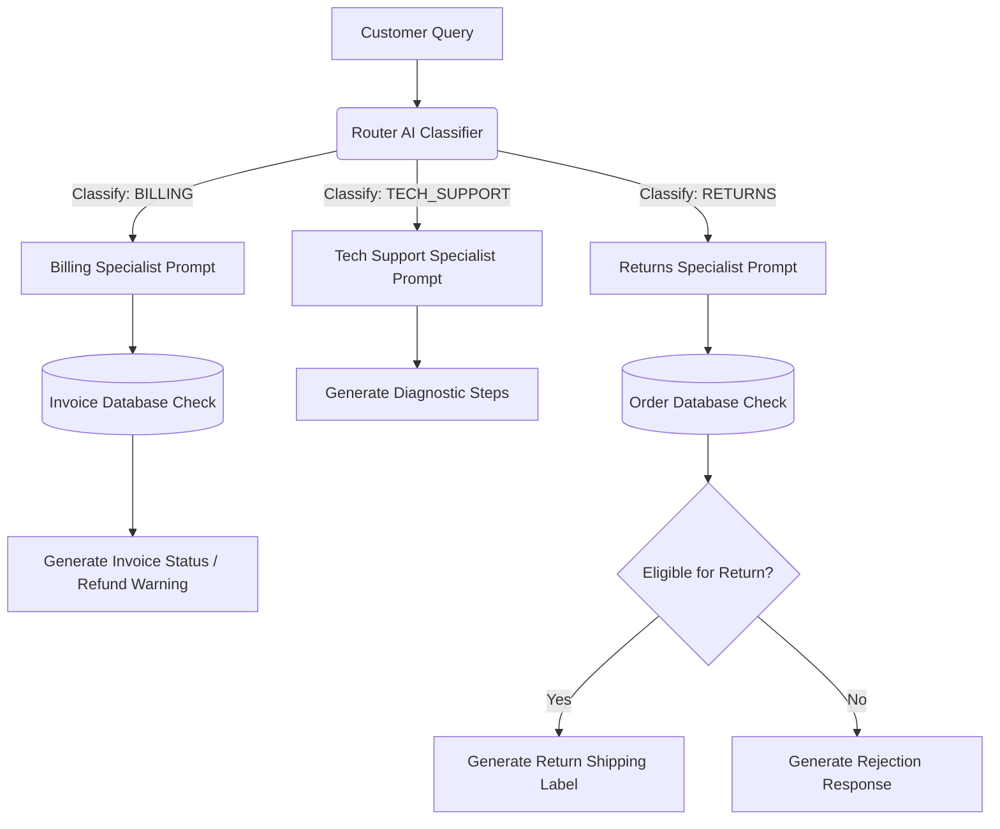

## 🚀 Overview

The Routing Pattern is an agentic workflow where an incoming customer query is classified by a **Router AI (Classifier)** and dispatched to a specialized downstream expert prompt, prompt chain, or database.

This prevents instructions from getting diluted in a single giant prompt, optimizes latency and cost (by matching queries to simpler prompts or cheaper models), and keeps agent code modular.

## 🛠️ Features

- **Intent Triage (Classification)**: Utilizes a dedicated routing prompt to accurately categorize user intent into `BILLING`, `TECH_SUPPORT`, or `RETURNS`.
- **Resource-Aware Processing**: Billing and Returns routes dynamically query a simulated local database (`database.json`) to ground responses in accurate customer records.
- **Troubleshooting Engine**: Tech Support route uses generative diagnostic reasoning to resolve generic technical issues with safety fallbacks.
- **Eligibility Evaluation**: Returns route checks order delivery status and age (>30 days since purchase) before dynamically generating a text-based shipping return label (with RMA and barcode).

## 📁 Repository Structure

- `routing.ipynb`: The interactive Jupyter Notebook walkthrough showing client initialization, routing, and specialist agent prompts.
- `database.json`: The simulated database containing invoice states and order purchasing records.
